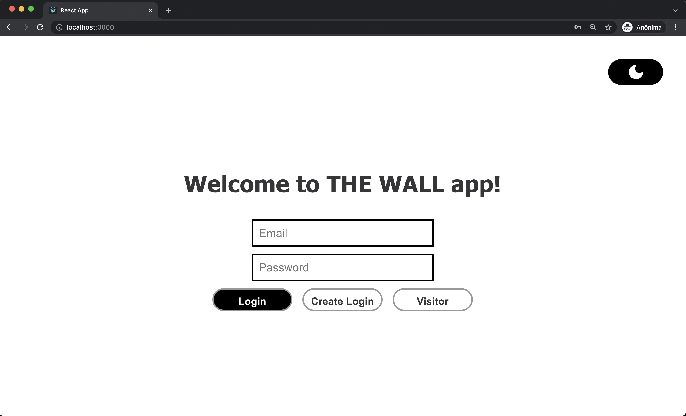
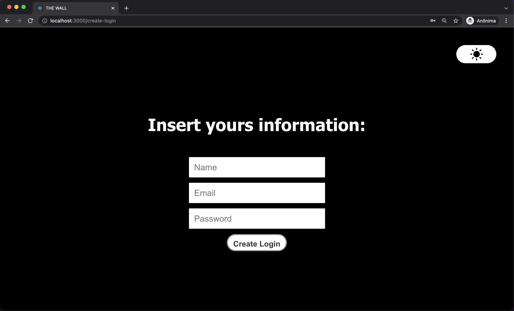
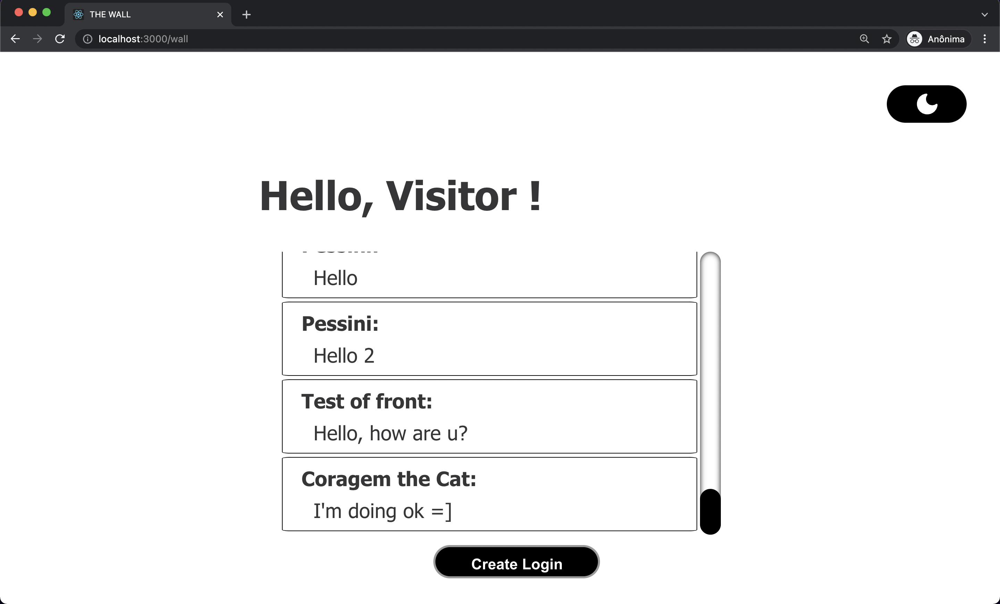
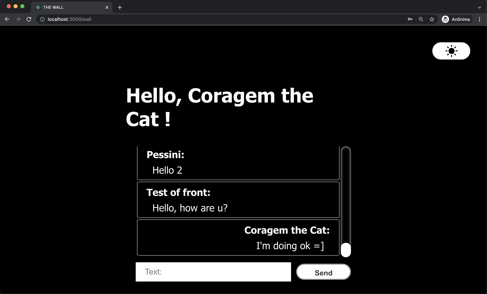

# The Wall - Frontend

> Wall App is an application that allows users to register, login, and write on a wall..

Link to back-end project is below:

* Backend API NestJS: []()

For the construction of this app was chosen **[REACT](https://reactjs.org/)** and **[Styled Components](https://styled-components.com/)**.

With **Styled Components** it's possible to use ES6 in CSS. Styled-components has full theming support by exporting a <ThemeProvider> wrapper component. This component provides a theme to all React components underneath itself via the context API. Making it easier to build a Dark Mode like in this project.

For the tests, e2e was chosen **[CYPRESS](https://www.cypress.io/)**. We'll talk about testing later.

## Getting Started

These instructions will get you a copy of the full project up and running on your local machine for development and testing purposes.

The project can be built with npm or yarn.

It's necessary the back end is running on port 3001.

## How to Install

### Frontend (React)

* To download the project, follow the instructions below:

```
1. git clone
2. cd
```

* Install the dependencies and start the project:

```
3. yarn install
4. yarn start
```

or

```
3. npm install
4. npm start
```
## Tests

Choice **Cypress** because Cypress is a next-generation front end testing tool built for the modern web. Cypress enables you to write all types of tests, include end to end.

End to end: A helper robot that behaves like a user to click around the app and verify that it functions correctly. Sometimes called "functional testing" or e2e. Your test will interact with the app just like a typical user would, it's mean that your test is giving you more confidence.

* To run the test:

```
yarn run cypress open 
```
or
```
npm run cypress open 
```
## Keep in Touch

Diego Campos
* [Diego Campos](mailto:diegodiko05@gmail.com)

## Screen Shots

* Login:



* Create Login:



* WALL




## Thank you!

Thanks TSL! I really liked to build this App!
